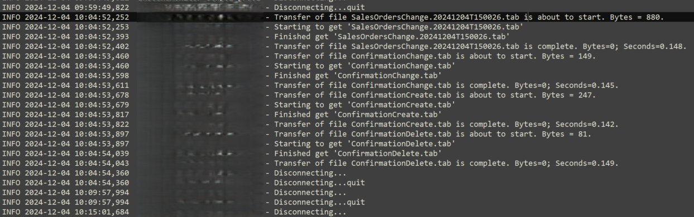
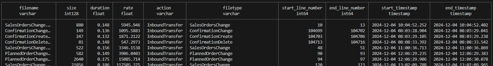

# Log Analysis Tool

## Overview
The Log Analysis Tool is a Python application designed to monitor and analyze file transfer speed rates by parsing log entries. It captures essential information about file transfers, including timestamps, filenames, file sizes, and transfer durations.

Currently this app is parsing the Inbound log file transforming:


into:


## Features
- Parses log entries for file transfer start and completion.
- Extracts relevant data such as timestamps, filenames, and file sizes.
- Calculates transfer speeds based on the parsed data.

## Project Structure
```
log-analysis-tool
├── src
│   ├── main.py          # Entry point of the application
│   ├── log_parser.py    # Contains the LogParser class for parsing log entries
│   └── utils
│       └── helpers.py   # Utility functions for string manipulation and data formatting
├── requirements.txt      # Lists project dependencies
├── README.md             # Documentation for the project
└── tests
    ├── test_log_parser.py # Unit tests for the LogParser class
    └── __init__.py       # Marks the tests directory as a package
```

## Installation
1. Clone the repository:
   ```
   git clone https://github.com/yourusername/log-analysis-tool.git
   ```
2. Navigate to the project directory:
   ```
   cd log-analysis-tool
   ```
3. Install the required dependencies:
   ```
   pip install -r requirements.txt
   ```

## Usage
To run the log analysis tool, execute the following command:
```
python src/main.py <path_to_log_file>
```

Replace `<path_to_log_file>` with the path to the log file you wish to analyze.
